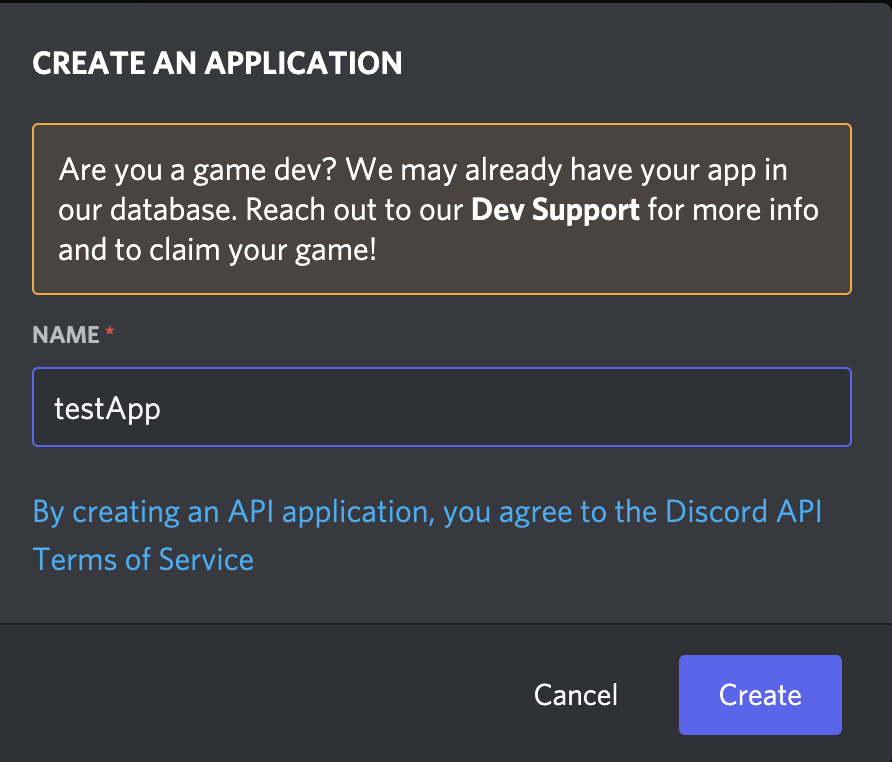
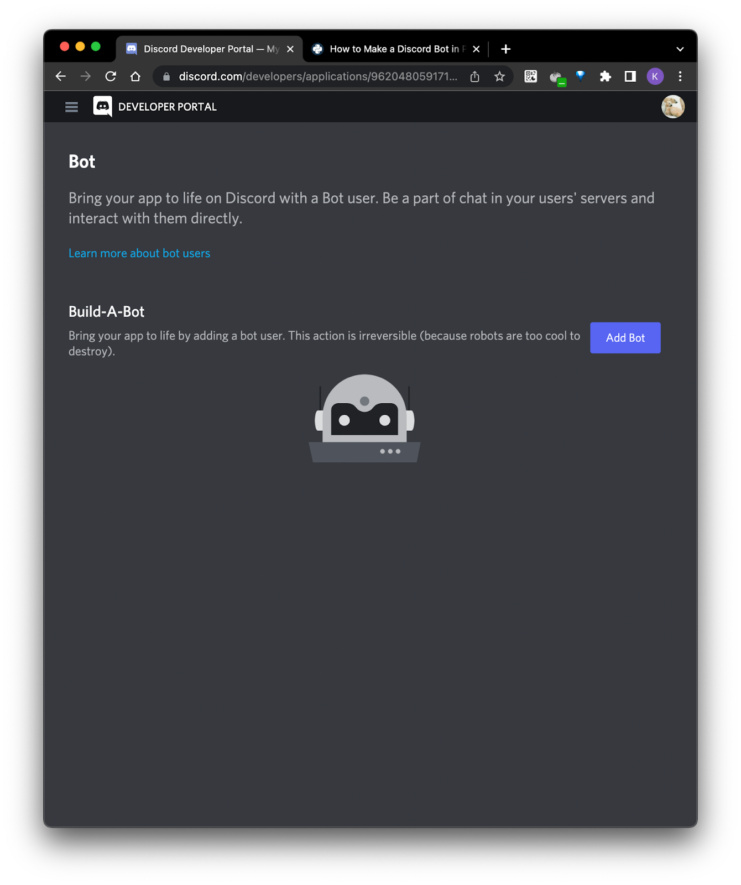

# Workshop Setup

Before you can make a discord bot, you first have to create a discord account, an application, a bot, and last but not least, a discord server. Once these are created, you can combine them by registering the bot into your guild.

## Discord Account Creation

Head over to https://discord.com/register and fill out the form to create an account. If you already have an account, you could skip this step by just logging into it. 

## Creating a Discord Application

Visit the [Discord Developer portal](https://discord.com/developers/applications). Select New Application and give it a name, then hit Create. Now you have a page with your application information, which would be used by your bot.

Now, on the sidebar of your application page, select Bot to see all your bots, or create a new one. Select ‘Create Bot’ to create a bot (**this is irreversible**). 

Now you have a dashboard for that bot within your application. To see your bot token, select ‘Reset Token’. (**This can only be done once so save it**)

## Creating a Discord Server

Head over to the discord app/website. Scroll to the bottom of your server list on the left side, and click on the plus (+) icon to add a server. Follow the steps to create a server, and you should have a screen similar to the one on this slide (created using a server template for friends). 

## Adding a Bot to your server

To add a bot, you head back to your application dashboard and select OAuth2 > URL Generator. Select ‘bot’ in scopes and give it ‘Administrator’ permissions. Copy the generated URL and visit it. Select the server you want to connect it to and click Continue & Authorize it. Now the Application is connected to the server and the bot should be in your server member list. 

## Connecting Your Bot Using Discord.py

Install discord.py:

- On Windows, run `py -3 -m pip install -U discord.py`
- Otherwise, run `python3 -m pip install -U discord.py`

Install dotenv:

- On Windows, run `py -3 -m pip install -U python-dotenv`
- Otherwise, run `python3 -m pip install -U python-dotenv`

Clone the workshop repo and open it up https://github.com/HackBinghamton/DiscordBotWorkshop. Paste in your bot token from earlier into the .env file, and run main.py to connect to your discord bo. If the program says your ‘bot has connected to Discord’ and prints out registered servers, you are done with the setup process!

## Next Section

We're done with setting up our Bot! Head to the [next section](https://github.com/HackBinghamton/DiscordBotWorkshop/blob/main/CreatingBot.md) where we will begin creating our Bot.  
